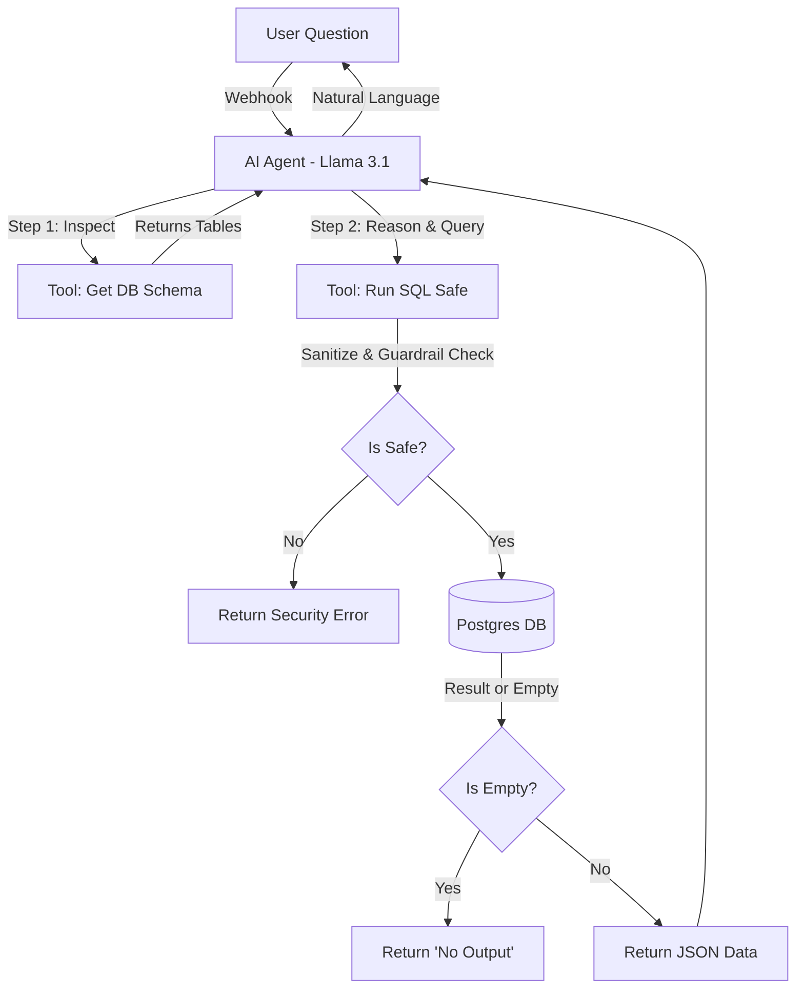

# Agentic SQL Chatbot Workflow

This directory contains the three JSON workflow files required to run the **Text-to-SQL AI Agent**.

## Workflow Architecture

Instead of a single massive workflow, this agent is modularized into a **Main T2SQL Agent** and **Two Tool Wrappers**.

### Why Separate Workflows?

We decoupled the tools into sub-workflows ("Wrappers") for two critical engineering reasons:

1.  **Input Definition for 8B Models:** The native n8n Postgres nodes are strict. Smaller models like Llama 3.1 8B often hallucinate inputs (e.g., sending arguments to a tool that requires none). By wrapping the tool, we could define custom inputs (like `unused_input`) to "catch" these hallucinations without crashing the agent.
2.  **Logic Injection:** A simple node cannot handle complex logic like sanitizing inputs, checking for `DELETE` commands, or handling empty database results. Wrapping them allows us to build a "Logic Layer" around every database interaction.

## The Workflows

### 1\. `Main_T2SQL_Agent.json` (The Brain)

This workflow hosts the **AI Agent** node. It handles the chat memory, user input, and reasoning loop.

  * **Model:** Llama 3.1 (via Groq) or any other model
  * **Prompting Strategy:** Uses a manual **Chain of Thought (CoT)** system prompt. It forces the AI to:
    1.  Inspect Schema first.
    2.  Formulate a plan.
    3.  Execute the query.
    4.  Summarize results.
  * **Search Protocol:** The system prompt explicitly enforces `ILIKE` logic (`WHERE name ILIKE '%query%'`) to handle case-insensitive searches (e.g., finding "Gaming Laptop" when the user asks for "gaming laptop").

### 2\. `Tool_Get_Schema.json`

**Purpose:** Fetches table names and columns to ground the AI's knowledge.
**Key Features:**

  * **The "Dummy Input" Fix:** Llama 3.1 8B often tries to send input data to this tool even though none is required. We added a dummy field (`unused_input`) in the trigger node so n8n accepts the request instead of throwing a "Schema Mismatch" error.

### 3\. `Tool_Run_SQL_Safe.json`

**Purpose:** Executes the SQL query generated by the AI. This workflow contains the bulk of the safety logic.

**Implementation Details:**

  * **Sanitization Layer:** An `Edit Fields` node strips Markdown backticks (\`\`\`sql) and whitespace from the AI's input using JavaScript `.replace()`.
  * **Security Guardrail:** An `If` node verifies the query starts with `select` (case-insensitive).
      * *Implementation:* We used `{{ $json.query.trim().toLowerCase() }}` -\> **Starts With** -\> `select`. This effectively blocks `DELETE`, `DROP`, or `INSERT` commands.
  * **Empty Result Handling:**
      * **The Problem:** Postgres returns nothing (0 items) if no rows match.
      * **The Fix:** We enabled "Always Output Data" on the Postgres node. An `If` node checks `{{ Object.keys($json).length == 0 }}`. If true, it returns a hardcoded `{ "result": "No Output" }` JSON to the AI, preventing it from hallucinating fake data.
  * **Error Reporting:** If the query fails (syntax error), the workflow catches the error (using "On Error: Continue") and passes the exact error message back to the AI so it can self-correct.

## Logic & Data Flow

The core agent uses a **"ReAct"** (Reasoning + Acting) approach.

## ⚙️ Setup & Import Instructions

Because these workflows rely on calling each other, the links will break upon import (as n8n assigns new IDs to every node).

**Follow this sequence:**

1.  **Import Files:** Import all three JSON files into your n8n editor.
2.  **Re-Link Tools:**
      * Open the `Main_Agent` workflow.
      * Double-click the **Call n8n Workflow Tool** node named `get_db_schema`.
          * In the "Workflow" dropdown, select the `Tool_Get_Schema` workflow you just imported.
      * Double-click the **Call n8n Workflow Tool** node named `run_sql_query`.
          * In the "Workflow" dropdown, select the `Tool_Run_SQL_Safe` workflow.
3.  **Verify Credentials:** Ensure the Postgres nodes inside the two Tool workflows are connected to your Postgres Credential (`Host: postgres`, `User: n8n`, `Database: n8n`).
4.  **Save** all workflows.
5.  **Activate:** Toggle the `Active` switch on the Main Agent to start listening for chat messages.